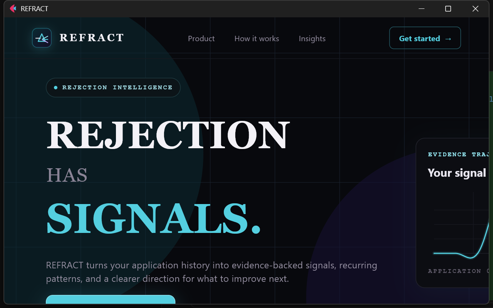
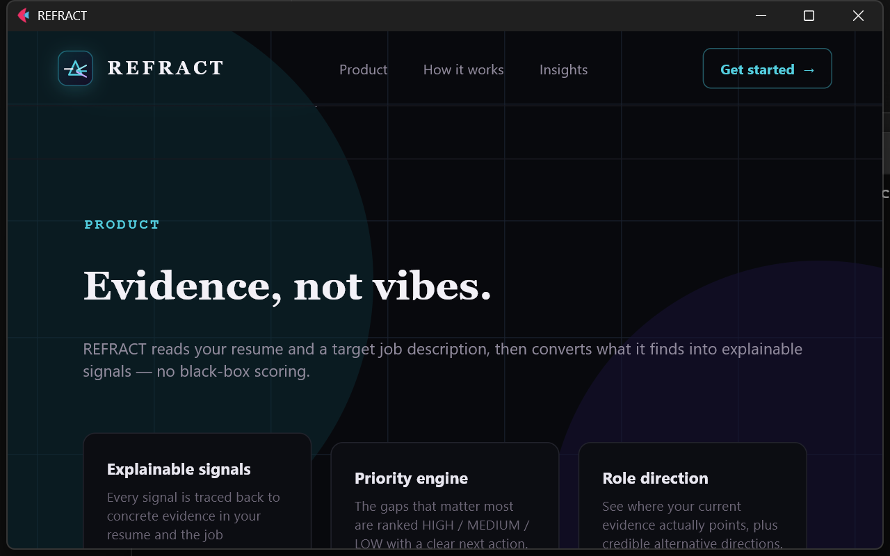
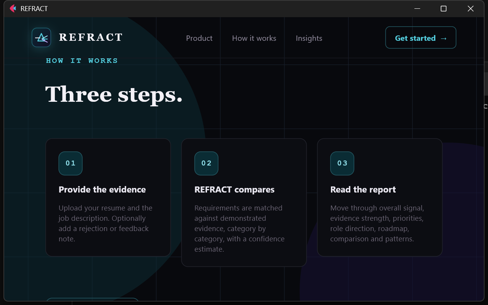
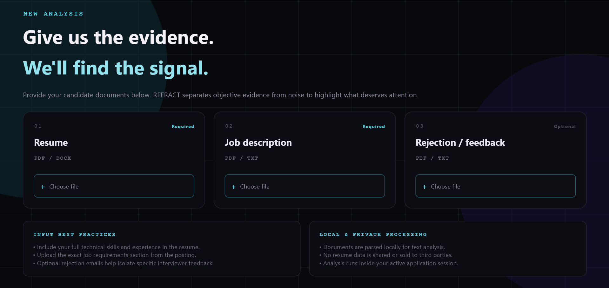
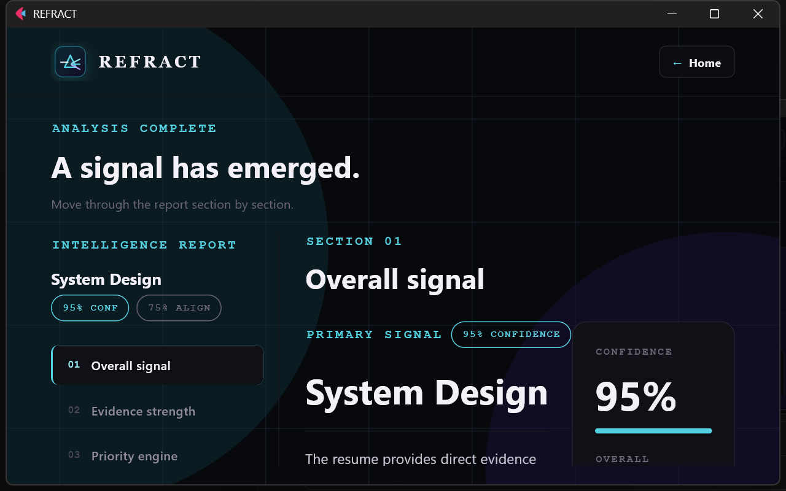
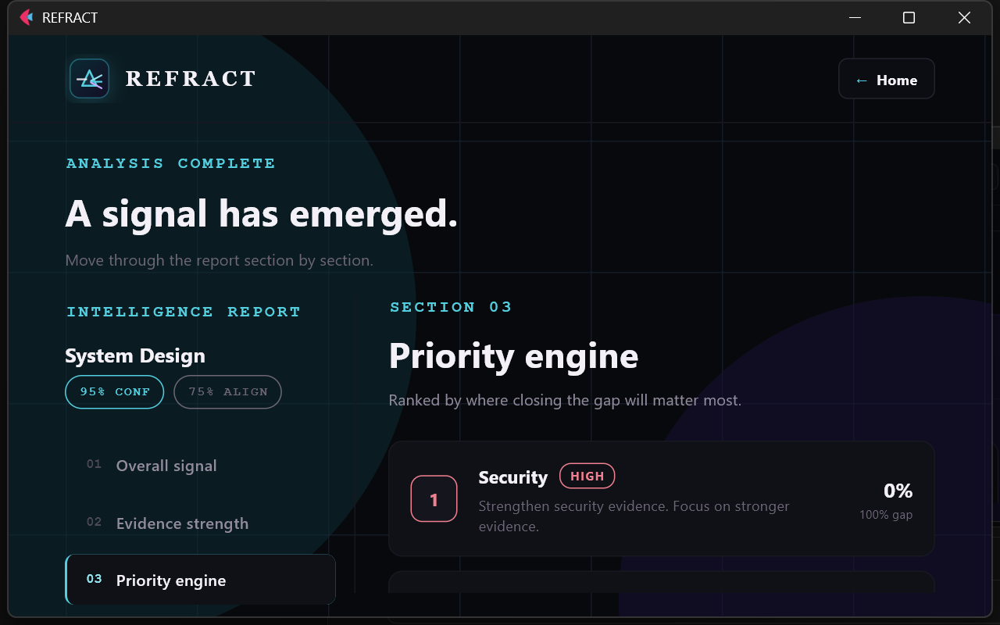
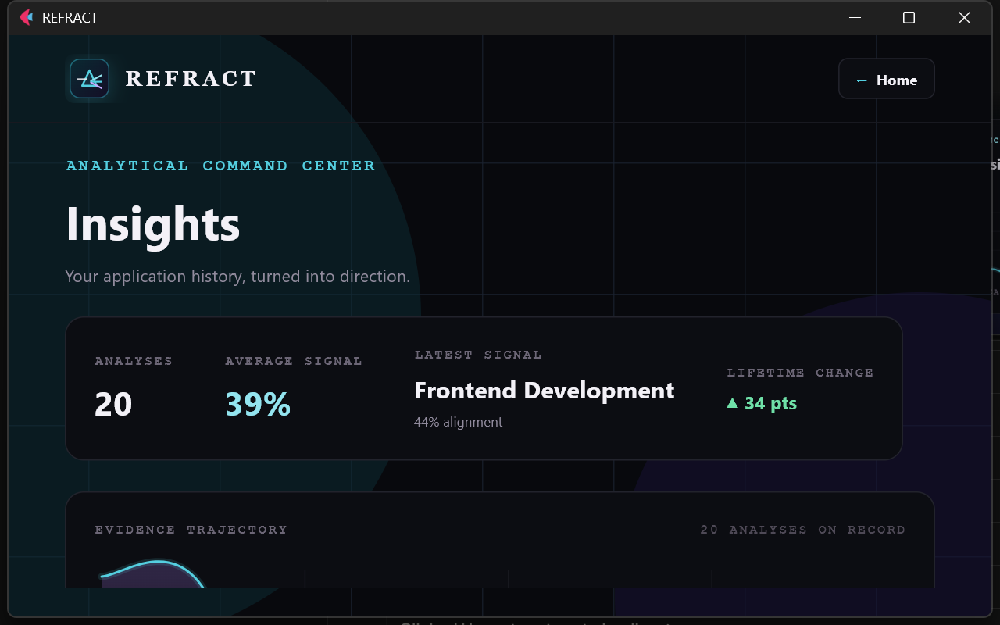
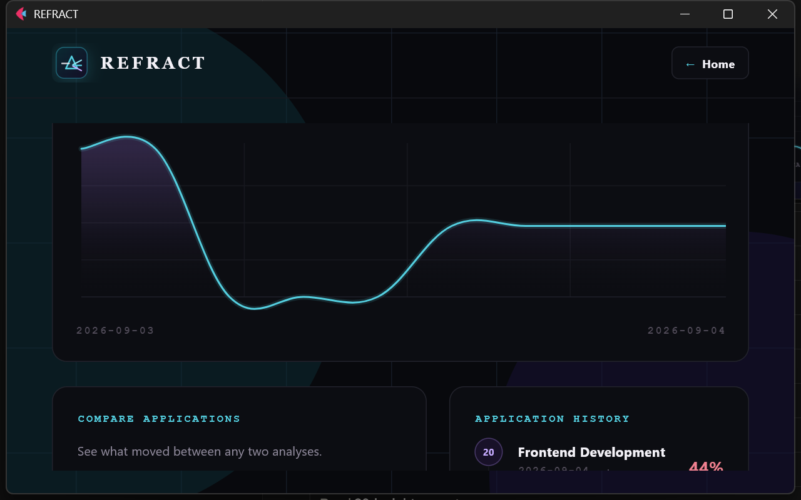

<div align="center">



<br/>

# REFRACT

### Rejection has signals.

REFRACT turns a resume, a job description, and an optional rejection note into evidence-backed signals — what matched, what's missing, what to fix first, and where your evidence actually points.

<br/>


</div>

---

## What is REFRACT

Most rejections come with no explanation. REFRACT gives you one — built entirely from evidence, not guesswork.

Upload a **resume** and a **job description** (and optionally a rejection/feedback note), and REFRACT produces a full intelligence report: an overall signal, per-requirement evidence strength, a ranked priority list, a role-direction estimate, a personal improvement roadmap, and — once you've run more than one analysis — comparisons and recurring patterns across your application history.

Every claim REFRACT makes is traceable back to text it actually found in your documents. It never presents an inference as a confirmed recruiter decision.

---

## Features

| | |
|---|---|
| 🎯 **Explainable signals** | Every signal is traced back to concrete evidence in your resume and the job requirements — no black-box scoring. |
| 📊 **Evidence strength analysis** | Each matched requirement is scored Strong / Moderate / Weak / Missing, with a plain-English reason. |
| 🔥 **Priority engine** | The gaps that matter most, ranked HIGH / MEDIUM / LOW with a concrete next action. |
| 🧭 **Role direction finder** | See where your current evidence actually points, plus credible alternative directions. |
| 🗺️ **Personal roadmap** | A practical, ordered sequence for closing your strongest gaps. |
| 📈 **Application comparison** | Track score, confidence, and category movement between any two analyses. |
| 🔁 **Pattern detection** | Recurring gaps and chronically weak categories surface automatically across your history. |
| 🎙️ **Voice commands** | Start an analysis, open Insights, or go home — hands-free, fully optional. |
| 🔒 **Local-first** | Documents are parsed locally. Only analysis results (never raw resume/JD text) are saved to disk. |

---

## Screenshots

<table>
<tr>
<td width="50%">

**Product**


</td>
<td width="50%">

**How it works**


</td>
</tr>
<tr>
<td width="50%">

**New analysis**


</td>
<td width="50%">

**Intelligence report**


</td>
</tr>
<tr>
<td width="50%">

**Priority engine**


</td>
<td width="50%">

**Insights — command center**


</td>
</tr>
<tr>
<td colspan="2">

**Evidence trajectory & application history**


</td>
</tr>
</table>

---

## How it works

```
01  Provide the evidence     →  Upload a resume + job description (PDF/DOCX/TXT).
                                 Optionally add a rejection or feedback note.

02  REFRACT compares          →  Requirements are matched against demonstrated
                                 evidence, category by category, with a
                                 confidence estimate.

03  Read the report           →  Move through Overall Signal, Evidence Strength,
                                 Priority Engine, Role Direction, Roadmap,
                                 Comparison and Patterns — section by section.
```

---

## Tech stack

| Layer | Technology |
|---|---|
| UI framework | [Flet](https://flet.dev) 0.86.5 (Python → Flutter, desktop + web) |
| Language | Python 3.13 |
| Document parsing | `pypdf`, `python-docx` |
| Voice input | `SpeechRecognition` + `PyAudio` |
| Persistence | Local JSON history file (`refract_history.json`) — no external database |
| Graphics | `flet.canvas` — hand-drawn evidence-trajectory graph, no charting library |

---

## Getting started

```bash
# 1. Clone and enter the project
git clone <your-repo-url>
cd REFRACT-AI

# 2. Create a virtual environment and install dependencies
python -m venv .venv
.venv\Scripts\activate          # Windows
pip install -r requirements.txt # or: flet, pypdf, python-docx, SpeechRecognition, PyAudio

# 3. Run it
.venv\Scripts\flet.exe run main.py
```

That opens the native desktop window. To preview it in a browser instead:

```bash
.venv\Scripts\flet.exe run --web main.py
```

---

## Voice commands

The microphone button is optional — every action also works with mouse and keyboard.

| Say | Action |
|---|---|
| "Start analysis" / "Begin analysis" | Runs the current analysis |
| "New analysis" | Starts a fresh analysis |
| "Open insights" | Jumps to the Insights command center |
| "Compare applications" | Opens comparison |
| "Show roadmap" | Opens the personal roadmap |
| "Show patterns" | Opens recurring patterns |
| "Go home" | Returns to the landing page |
| "Help" | Lists available commands |

---

## Project structure

```
REFRACT-AI/
├── main.py                  # App entry point & navigation
├── components/
│   ├── ui.py                 # Design system — colors, buttons, nav, animated grid
│   ├── graph.py               # Canvas-based evidence trajectory graph
│   └── voice.py                # Voice button + status UI
├── pages/
│   ├── landing.py             # Marketing landing page
│   ├── analysis.py             # Upload & begin-analysis flow
│   ├── results.py               # Intelligence report (7 sections)
│   └── insights.py               # Analytical command center
└── services/
    ├── parser.py                # PDF / DOCX / TXT text extraction
    ├── analyzer.py                # Core evidence-matching engine
    ├── evidence.py                 # Evidence strength scoring
    ├── priority.py                  # Priority ranking
    ├── role_direction.py             # Role direction detection
    ├── roadmap.py                     # Improvement roadmap builder
    ├── patterns.py                     # Recurring pattern detection
    ├── history.py                       # Local history persistence
    ├── voice.py                          # Speech recognition
    └── voice_parser.py                    # Voice command parsing
```

---

## Privacy

- Resumes and job descriptions are parsed **locally** — nothing is uploaded anywhere.
- Only structured analysis results (signal, scores, matched/missing keywords) are saved to `refract_history.json`. Raw document text is never stored.
- Voice recognition uses Google's public speech API only when you press the microphone button — it is never active by default.

---

## Author

**Krishiv Sharma**
B.Tech Computer Science (Cyber Security) · SRM Institute of Science and Technology, Kattankulathur

[GitHub](https://github.com/<your-username>) · [LinkedIn](https://linkedin.com/in/<your-handle>)

---

<div align="center">

**Evidence-first · Confidence-aware · Privacy-conscious**

</div>
